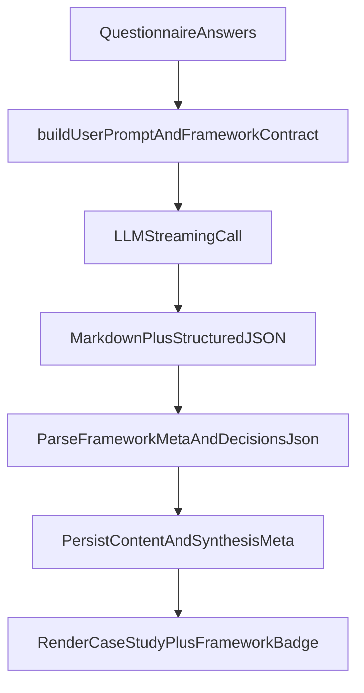

# AI Story Framework Synthesis Plan

## Goal

Enable synthesis to automatically select one of six storytelling frameworks (Prescriptive, Hero, FamiliarToForeign, Framed, Layered, ContextualInterlude) and generate output that clearly follows that structure, with minimal but explicit structural support beyond prompt-only tuning.

## Why this route

- Prompt-only is fast but brittle for framework adherence.
- A light structure layer adds guardrails (`selectedFramework` + required beats) without heavy refactors.
- Current pipeline already parses structured JSON for insights, so extending the contract is low-friction.

## Targeted Changes

- Update prompt contract in `[c:\Users\Khoa\Documents\Cursor\Test\lib\ai\prompts.ts](c:\Users\Khoa\Documents\Cursor\Test\lib\ai\prompts.ts)`
  - Add a framework taxonomy section with concise definitions and trigger heuristics for all six structures.
  - Require model to output a new JSON block containing:
    - `selectedFramework`
    - `frameworkRationale` (short)
    - `plotBeats` (framework-specific required beats)
  - Keep existing insights JSON, but combine into one stricter output contract or two clearly delimited contracts.
- Add output parsing + fallback behavior in `[c:\Users\Khoa\Documents\Cursor\Test\components\CaseStudyPreview.tsx](c:\Users\Khoa\Documents\Cursor\Test\components\CaseStudyPreview.tsx)`
  - Parse the new framework metadata block.
  - If JSON is invalid/missing, fall back gracefully to rendering markdown and infer as `Prescriptive` for display-only labeling.
- Add light metadata persistence in `[c:\Users\Khoa\Documents\Cursor\Test\lib\storage\projects.ts](c:\Users\Khoa\Documents\Cursor\Test\lib\storage\projects.ts)`
  - Store optional `synthesisMeta` (`selectedFramework`, `frameworkRationale`, `plotBeats`) alongside `synthesizedContent`.
  - Keep backward compatibility for existing projects.
- Add optional display affordance in `[c:\Users\Khoa\Documents\Cursor\Test\app\project\[id]\result\page.tsx](c:\Users\Khoa\Documents\Cursor\Test\app\project\[id]\result\page.tsx)`
  - Show selected framework badge or caption so users can verify structure choice.
  - No mandatory questionnaire/schema input changes needed for auto-selection.
- Keep API flow unchanged in `[c:\Users\Khoa\Documents\Cursor\Test\lib\ai\client.ts](c:\Users\Khoa\Documents\Cursor\Test\lib\ai\client.ts)` and `[c:\Users\Khoa\Documents\Cursor\Test\app\api\synthesize\route.ts](c:\Users\Khoa\Documents\Cursor\Test\app\api\synthesize\route.ts)`
  - Reuse current streaming architecture; only prompt and downstream parsing/storage behavior change.

## Framework Fitting Logic (in prompt contract)

- Require model to do a short internal mapping:
  - classify input signal density (timeline clarity, protagonist arc, contrast across contexts, sensory details, etc.)
  - choose one framework
  - emit required beats for that framework
  - draft case study sections using those beats
- Include hard validation rules in prompt:
  - output must include all required beats for chosen framework
  - beats must cite user-provided facts (via existing source contract)
  - reject invented events and over-claims (plausibility rule from chapter)

## Minimal Data Model Impact

- No required changes to `[c:\Users\Khoa\Documents\Cursor\Test\lib\questionnaire\schema.ts](c:\Users\Khoa\Documents\Cursor\Test\lib\questionnaire\schema.ts)` for this phase.
- Keep auto-selection purely AI-driven.
- Add only persisted synthesis metadata (post-generation), not new input questions.

## Validation & Testing

### Golden test set (questionnaire inputs by framework)

Use `**QuestionnaireAnswersV2**` payloads with `POST /api/synthesize` (`{ "answers": … }`) or paste into the Traceability Builder + other steps. Keep `evidenceFiles` empty unless you are testing image grouping; omit or zero out `traceAndExecution` fields you do not need. IDs below are examples—keep them consistent within each fixture.

**How to use:** For each row, copy the **signal focus** into the matching sections. Minimal trace rows are included so `DECISIONS_JSON` / `questionnaireDecisionId` behavior can be tested; you can trim to a single insight + decision if you only care about framework choice.

| #   | Target framework    | Primary signal you are loading into the prompt                                            |
| --- | ------------------- | ----------------------------------------------------------------------------------------- |
| 1   | Prescriptive        | Linear causality: context → measurable trigger → intervention → outcome (numbers OK).     |
| 2   | Hero                | One protagonist, refusal/resistance, trials/setbacks, breakthrough, return with learning. |
| 3   | FamiliarToForeign   | Comfortable “normal” opens; mid-body shifts into unfamiliar concept, tool, or context.    |
| 4   | Framed              | Deliberate parallel open/close (same situation twice) with changed understanding.         |
| 5   | Layered             | Several short, concrete “snapshot” moments that only resolve meaning late.                |
| 6   | ContextualInterlude | Sensory / environmental / emotional texture that carries meaning (not only tasks).        |

---

#### 1) Prescriptive (causal chain)

- **problemAndGoals.problem:** “Checkout abandonment spiked after we added address verification. Users completed cart but dropped at the verification step.”
- **problemAndGoals.targetUsers:** “US mobile shoppers, 25–45, mostly first-time buyers.”
- **problemAndGoals.successCriteria:** “Reduce drop-off at verification by 15% without increasing fraud chargebacks.”
- **traceAndExecution:** One insight (“Users interpreted the extra step as a trust risk, not fraud protection.”) linked to one decision (“We reframed copy and moved verification after shipping selection.”). Keep `insightToDecision` consistent.
- **impactAndLearnings.metrics:** “Verification-step completion +18% in two weeks; chargeback rate unchanged.”
- **impactAndLearnings.feedback:** “Support tickets about ‘is this legit?’ fell.”

Avoid heroic “refused the quest” language; keep tone analytic and stepwise.

---

#### 2) Hero (journey arc)

- **problemAndGoals.problem:** “Alex, the PM, inherited a redesign with no research budget and a fixed launch date. The team wanted to ship fast; Alex believed we would miss the real usability failure mode.”
- **problemAndGoals.targetUsers:** “Power users who rely on keyboard shortcuts and batch actions.”
- **Narrative shape in trace/impact text:** Explicit **refusal** (“Alex pushed back on cutting research”), **trials** (time pressure, stakeholder conflict, failed prototype), **breakthrough** (narrow qualitative sessions surfaced the blocker), **return** (launch with a guardrail metric Alex now owns).

Use **one named protagonist** (“Alex”) and **obstacles** in `traceAndExecution.decisions[].execution` and `impactAndLearnings.personalLearnings`.

---

#### 3) FamiliarToForeign (known → unfamiliar)

- **projectOverview.clientContext:** “Enterprise HR team used to paper onboarding packets everyone understood.”
- **problemAndGoals.problem:** “We needed to introduce automated identity verification and document capture. For HR, ‘familiar’ was in-person checks; ‘foreign’ was trusting camera capture and machine-assisted review.”
- **problemAndGoals.successCriteria:** “Adoption by regional offices without reverting to paper exceptions.”
- **traceAndExecution:** Insights that move from “we always did it this way” to “the new pipeline changes what ‘proof’ means.”

Open in **mundane, trusted** process; middle sections **bridge** to the new model; close on **new normal**, not a generic feature list.

---

#### 4) Framed (open ≈ close, meaning shifts)

- **problemAndGoals.problem:** “Day one of the project: we opened the same analytics dashboard we use every Monday. Six weeks later we opened that same dashboard again—but the metric we cared about had changed, and so had what ‘healthy’ meant.”
- **impactAndLearnings.personalLearnings:** Echo the opening image in one sentence with contrast (“Same screen, different question.”).

Mirror **setting or ritual** at start and end; middle holds the contrast (MiddleContrast / frame-close-changed beat).

---

#### 5) Layered (accumulating snapshots)

- **problemAndGoals.problem:** Do **not** state the thesis in sentence one. Instead use several short paragraphs or bullet-like lines in **one field** or split across **multiple insights** as distinct observations:
  - “Session replay clip 1: user pauses on label copy.”
  - “Clip 2: user opens help, closes it, retries same field.”
  - “Clip 3: user succeeds after an error message they did not read fully.”
- **traceAndExecution.insights:** Three separate insight rows, each one **one scene**; decision ties them together late (“We consolidated errors into inline recovery instead of modal stacks.”).

The model should recognize **pattern-from-images** without an early “therefore.”

---

#### 6) ContextualInterlude (sensory / situational depth)

- **problemAndGoals.problem:** Lead with **environment and sensation** tied to the product moment, not abstract UX jargon first:
  - “The clinic waiting room hums under fluorescent light. Clipboards squeak. Parents lean toward the check-in tablet, shoulders tight, trying not to block the line.”
- **problemAndGoals.targetUsers:** Caregivers under time stress.
- **impactAndLearnings.feedback:** Keep some **texture** in user quotes (“hands full,” “couldn’t hear the confirmation tone”).

Goal: model picks **ContextualInterlude** because **texture** is load-bearing, not only task flow.

---

### Optional file-based fixtures

To version these in-repo for scripts or CI (not required for manual QA), save six JSON files under e.g. `test/fixtures/synthesis-golden/` with full `QuestionnaireAnswersV2` objects (empty `evidenceFiles` or tiny placeholder files). The **text above** is the source of truth for what each file should contain.

### Verify per sample

- Chosen `selectedFramework` in `FRAMEWORK_JSON` is plausible for the signal.
- Required `plotBeats` for that framework are present and named correctly.
- Markdown narrative stays within length rules and remains portfolio-usable.
- `FRAMEWORK_JSON` and `DECISIONS_JSON` blocks parse; decisions include `questionnaireDecisionId` when trace rows exist.
- Regression: old saved `synthesizedContent` without framework markers still renders (inferred / fallback).

## Data Flow

## Decision: prompt vs file structure

- Recommended: not prompt-only.
- Best efficiency/accuracy tradeoff: prompt upgrades + small output/parsing/storage structure (no questionnaire schema redesign).

