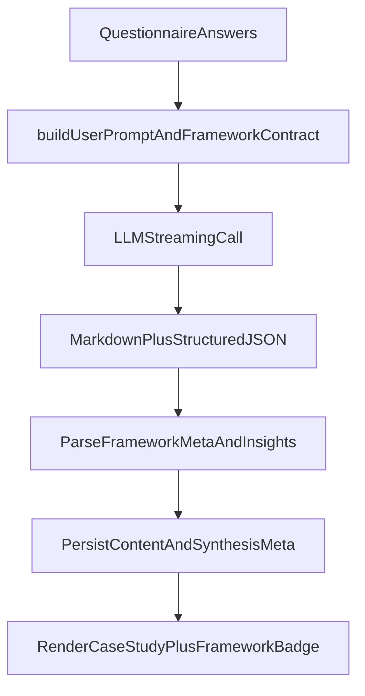

# AI Story Framework Synthesis Plan

## Goal

Enable synthesis to automatically select one of six storytelling frameworks (Prescriptive, Hero, FamiliarToForeign, Framed, Layered, ContextualInterlude) and generate output that clearly follows that structure, with minimal but explicit structural support beyond prompt-only tuning.

## Why this route

- Prompt-only is fast but brittle for framework adherence.
- A light structure layer adds guardrails (`selectedFramework` + required beats) without heavy refactors.
- Current pipeline already parses structured JSON for insights, so extending the contract is low-friction.

## Targeted Changes

- Update prompt contract in `[c:\Users\Khoa\Documents\Cursor\Test\lib\ai\prompts.ts](c:\Users\Khoa\Documents\Cursor\Test\lib\ai\prompts.ts)`
  - Add a framework taxonomy section with concise definitions and trigger heuristics for all six structures.
  - Require model to output a new JSON block containing:
    - `selectedFramework`
    - `frameworkRationale` (short)
    - `plotBeats` (framework-specific required beats)
  - Keep existing insights JSON, but combine into one stricter output contract or two clearly delimited contracts.
- Add output parsing + fallback behavior in `[c:\Users\Khoa\Documents\Cursor\Test\components\CaseStudyPreview.tsx](c:\Users\Khoa\Documents\Cursor\Test\components\CaseStudyPreview.tsx)`
  - Parse the new framework metadata block.
  - If JSON is invalid/missing, fall back gracefully to rendering markdown and infer as `Prescriptive` for display-only labeling.
- Add light metadata persistence in `[c:\Users\Khoa\Documents\Cursor\Test\lib\storage\projects.ts](c:\Users\Khoa\Documents\Cursor\Test\lib\storage\projects.ts)`
  - Store optional `synthesisMeta` (`selectedFramework`, `frameworkRationale`, `plotBeats`) alongside `synthesizedContent`.
  - Keep backward compatibility for existing projects.
- Add optional display affordance in `[c:\Users\Khoa\Documents\Cursor\Test\app\project\[id]\result\page.tsx](c:\Users\Khoa\Documents\Cursor\Test\app\project\[id]\result\page.tsx)`
  - Show selected framework badge or caption so users can verify structure choice.
  - No mandatory questionnaire/schema input changes needed for auto-selection.
- Keep API flow unchanged in `[c:\Users\Khoa\Documents\Cursor\Test\lib\ai\client.ts](c:\Users\Khoa\Documents\Cursor\Test\lib\ai\client.ts)` and `[c:\Users\Khoa\Documents\Cursor\Test\app\api\synthesize\route.ts](c:\Users\Khoa\Documents\Cursor\Test\app\api\synthesize\route.ts)`
  - Reuse current streaming architecture; only prompt and downstream parsing/storage behavior change.

## Framework Fitting Logic (in prompt contract)

- Require model to do a short internal mapping:
  - classify input signal density (timeline clarity, protagonist arc, contrast across contexts, sensory details, etc.)
  - choose one framework
  - emit required beats for that framework
  - draft case study sections using those beats
- Include hard validation rules in prompt:
  - output must include all required beats for chosen framework
  - beats must cite user-provided facts (via existing source contract)
  - reject invented events and over-claims (plausibility rule from chapter)

## Minimal Data Model Impact

- No required changes to `[c:\Users\Khoa\Documents\Cursor\Test\lib\questionnaire\schema.ts](c:\Users\Khoa\Documents\Cursor\Test\lib\questionnaire\schema.ts)` for this phase.
- Keep auto-selection purely AI-driven.
- Add only persisted synthesis metadata (post-generation), not new input questions.

## Validation & Testing

- Golden test set: 6 representative projects, one per framework signal profile.
- Verify per sample:
  - chosen framework is plausible
  - required beats are present
  - markdown remains coherent and portfolio-usable
  - insights/source JSON still parseable
- Add regression checks for old saved projects with no metadata.

## Data Flow

## Decision: prompt vs file structure

- Recommended: not prompt-only.
- Best efficiency/accuracy tradeoff: prompt upgrades + small output/parsing/storage structure (no questionnaire schema redesign).

