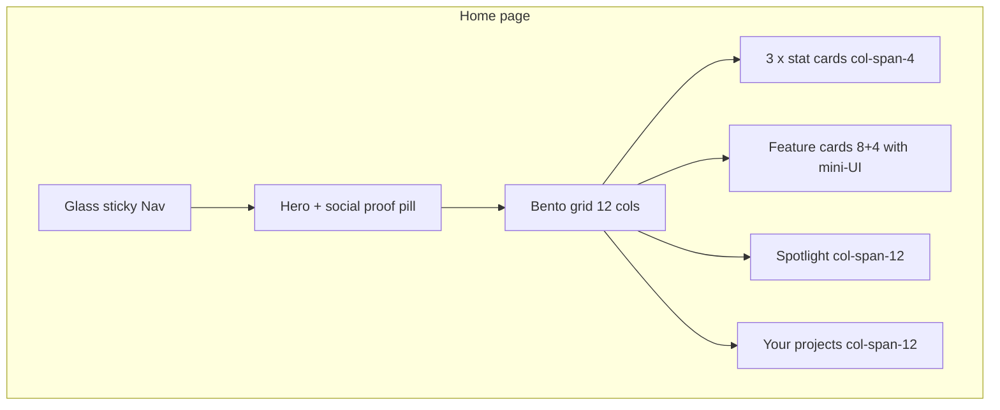

# Bento UI aesthetic refresh

## Current state

- **Stack:** Next.js App Router, Tailwind 3, fonts from `[app/layout.tsx](app/layout.tsx)` (Geist + Geist Mono), minimal `[tailwind.config.ts](tailwind.config.ts)`.
- **Home:** `[components/ProjectList.tsx](components/ProjectList.tsx)` is the entire landing UX: flat `border-b` header, `max-w-2xl` list—no hero or Bento layout.
- **Palette today:** Heavy use of `stone-*` utilities across `[components/*.tsx](components/)`, `[app/project/**/*.tsx](app/project/)`, `[app/showcase/**/*.tsx](app/showcase/)`, etc. (grep shows ~15+ files).

## Design tokens (single source of truth)

Extend `[tailwind.config.ts](tailwind.config.ts)` with:


| Token                  | Value     | Usage                                         |
| ---------------------- | --------- | --------------------------------------------- |
| `primary`              | `#2D5BFF` | Buttons, active states, icons, progress fills |
| `background` / page bg | `#F8F9FA` | `body`, shells                                |
| `accent.lavender`      | `#F0E7FF` | Secondary card surfaces                       |
| `accent.mint`          | `#E1F9F0` | Secondary card surfaces                       |
| `ink`                  | `#1A1A1A` | Primary text                                  |


Add `**letterSpacing`** for headlines: e.g. `tighthead: '-0.02em'` (~2% as requested; Tailwind’s default `tracking-tight` is slightly different).

Optional: `boxShadow` tweak if you want a named “float” shadow; otherwise `shadow-sm` / `shadow-md` as specified.

- **Avoid raw hex in TSX** once tokens exist: use `primary`, `ink`, `accent-lavender`, `accent-mint`, `bg-primary/10` for tags, etc., so refactors stay in `tailwind.config.ts`.

## Implementation refinements (explicit decisions)

These incorporate efficiency and maintainability tradeoffs (beyond the original AI reference).

1. **Phased rollout**
  - **Phase 1:** `tailwind.config.ts` + `[app/globals.css](app/globals.css)` primitives + `[app/layout.tsx](app/layout.tsx)` (Inter, body bg/text) + **home** (`ProjectList` / split components): glass nav, hero, Bento grid, projects block.
  - **Phase 2:** Shared `**PageHeader`** or `**AppShell`** (optional but recommended) + migrate **project / showcase / questionnaire** pages and **shared components** from `stone-*` to tokens.
  - **Rationale:** Smaller PRs, easier visual QA, less merge conflict than a single monolithic sweep.
2. **Bento row height (`h-full` + `justify-between`)**
  - Feature cards use `**flex flex-col justify-between h-full`**. The **parent grid row** must stretch children (default `align-items: stretch` on the grid is usually enough). If columns differ in content height, verify **equal-height behavior** on `md+` for the 8+4 row; on **small screens** stack to **one column** (`col-span-12`) to avoid awkward tall narrow cards.
3. `**prefers-reduced-motion`**
  - Add a global rule (e.g. in `[app/globals.css](app/globals.css)`) such as `@media (prefers-reduced-motion: reduce)` to **disable or soften** `translate` on hover (`transform: none` / remove `hover:-translate-y-1` effect). Keep shadow-only hover if motion is reduced. Optional: scope with Tailwind `motion-reduce:` variants where used.
4. **Glass nav / `backdrop-blur`**
  - Single sticky nav is acceptable. Avoid stacking multiple blurred layers. Optional: `**@supports (backdrop-filter: blur(0))**` with a solid fallback (`bg-white/95`) where blur is unsupported or for low-end perf tuning.
5. **Exported showcase HTML (`ShowcaseCreator`)**
  - **Default approach (plan):** keep class names / hex aligned with the live app for visual parity (accept some duplication with the string template).
  - **Alternative (if drift becomes painful):** ship a **small block of shared CSS** in the export, or **minimal inline styles** for body/typography only, and simplify classes in the template—document if you switch.
  - **Stretch:** render export from a shared React component (heavier refactor).
6. **Accessibility**
  - Before calling the sweep done, **spot-check contrast**: white text on `primary` buttons, `text-ink` / muted body on `background`, links and focus rings (`focus:ring-primary`).
7. **Variants vs. only `@layer`**
  - Start with **CSS layer** primitives; if card/button variants multiply, introduce `**clsx` + `tailwind-merge`** and optionally `**cva`** rather than many near-duplicate classes.

## Typography

- Use **Inter** as the primary UI typeface via `next/font/google` in `[app/layout.tsx](app/layout.tsx)` (e.g. `Inter({ variable: "--font-inter", subsets: ["latin"] })`; apply the variable class on `body`). Replace Geist for sans; keep Geist Mono for `font-mono` if still used.
- In `[tailwind.config.ts](tailwind.config.ts)`, set `**fontFamily.sans`** to `**["var(--font-inter)", "sans-serif"]`** so the stack is Inter, then the generic `**sans-serif`** system fallback if the variable font fails to load.
- Apply `**text-ink`** (or `text-[#1A1A1A]`) on `body` for default copy.
- Headlines: `**font-bold tracking-tighthead`** (or equivalent utility).

## Global shell

- Set `**body`** classes in root layout to `bg-background text-ink` (using new theme keys).
- Update `[app/questionnaire/layout.tsx](app/questionnaire/layout.tsx)` and any `min-h-screen bg-stone-50` wrappers to `**bg-background`** so questionnaire and redirects match.

## Reusable patterns (small surface area, high consistency)

To avoid repeating long class strings everywhere, add **thin helpers** (pick one approach and stick to it):

1. `**@layer components` in `[app/globals.css](app/globals.css)`** for primitives such as:
  - `.card-bento` → match **reference card shell** (see below): `rounded-[32px] border border-gray-100 bg-white p-8 shadow-sm flex flex-col justify-between h-full transition-all duration-300 hover:-translate-y-1 hover:shadow-lg` (use `hover:shadow-md` on denser list rows if `shadow-lg` feels heavy).
  - `.btn-primary` → `rounded-full bg-primary text-white …`
  - `.btn-secondary` → `rounded-full border border-gray-100 bg-white …`
  - `.nav-glass` → `sticky top-0 z-50 border-b border-gray-100/80 bg-white/70 backdrop-blur-md`
   **Or** 2) a tiny `**cn()`** helper (`clsx` + `tailwind-merge`) if you prefer composable classes in TSX.

Recommendation: **CSS layer classes** for buttons/cards/nav keeps dependencies at zero and matches “match existing project style.”

### Reference card pattern (medium / feature Bento cells)

Use this structure and hierarchy for **detailed feature cards** (8+4 grid); swap raw hex classes for theme tokens where equivalents exist (`text-ink`, `text-primary`, `bg-accent-lavender`, etc.).

**Reference excerpt (HTML):**

```html
<div class="bg-white rounded-[32px] p-8 border border-gray-100 shadow-sm hover:shadow-lg hover:-translate-y-1 transition-all duration-300 flex flex-col justify-between h-full">
  <div>
    <span class="bg-indigo-50 text-[#2D5BFF] px-4 py-1 rounded-full text-xs font-bold uppercase tracking-wider">
      Feature
    </span>
    <h3 class="text-2xl font-bold mt-6 tracking-tight text-[#1A1A1A]">
      Interactive Learning
    </h3>
    <p class="text-gray-500 mt-3 leading-relaxed">
      Master complex concepts with real-world sandboxes and real-time feedback.
    </p>
  </div>
  <div class="mt-8 pt-6 border-t border-gray-50">
    <div class="h-32 w-full bg-gradient-to-br from-[#F0E7FF] to-white rounded-2xl"></div>
  </div>
</div>
```

**Token alignment when implementing:**


| Reference class                          | Preferred mapping                                                                                                         |
| ---------------------------------------- | ------------------------------------------------------------------------------------------------------------------------- |
| `bg-indigo-50 text-[#2D5BFF]` (tag)      | `bg-primary/10 text-primary` (or `bg-[#2D5BFF]/10`) — keeps Electric Cobalt as the accent                                 |
| `text-[#1A1A1A]` (title)                 | `text-ink`                                                                                                                |
| `text-gray-500` (body)                   | `text-gray-500` or a muted token (e.g. `text-ink/60`) for consistency                                                     |
| `from-[#F0E7FF] to-white` (mini preview) | `from-accent-lavender to-white` (mint variant cards: `from-accent-mint to-white`)                                         |
| Tag                                      | `rounded-full`, `text-xs font-bold uppercase tracking-wider` per reference                                                |
| Mini preview container                   | `rounded-2xl` inner block; optional swap to `rounded-[24px]` if you want softer inner geometry than the outer `32px` card |


## Required UI blocks (home)

Implement on **home** by refactoring `[components/ProjectList.tsx](components/ProjectList.tsx)` (or splitting into `ProjectList` + new `HomeShell` / section components in `components/`):

1. **Glassmorphism nav**
  Sticky bar with `backdrop-blur-md`, `bg-white/70`, bottom border; brand + optional links (e.g. Showcase) aligned with current actions.
2. **Power hero**
  Centered or split layout: **large bold headline** + subcopy; **social proof pill** (`rounded-full`, subtle border/bg) e.g. “Join 10k+ learners” (static copy is fine unless you want it env-driven).
3. **Bento feature grid** (`grid grid-cols-12 gap-4` or `gap-6`, max width e.g. `max-w-6xl` + horizontal padding)
  - **Three small stat cards** (~1/3 width each): `col-span-12 md:col-span-4` — use plausible static stats or derive **project count** from `projects.length` for one card and static for the rest.  
  - **Two medium “feature” cards** (~2/3 + 1/3 or 8+4): follow the **reference card pattern** above (tag, title, body, footer + gradient preview); alternate lavender/mint. Ensure **grid stretches** sibling cells so `h-full` / `justify-between` footers align (see **Implementation refinements**).  
  - **One full-width spotlight** (`col-span-12`): primary value prop + CTA row.
4. **Projects area**
  Below the marketing Bento: **“Your projects”** as a `**col-span-12`** section—either a large bento card wrapping the list or a second grid row. Reuse existing list logic; style rows as `**card-bento`** children with `**rounded-[32px]`** (or slightly smaller for dense rows if 32px feels huge—prefer spec first, tune in review).
5. **Interactive cards**
  Apply `**hover:-translate-y-1 hover:shadow-md transition-all`** to interactive bento cards (and list rows where appropriate).

## App-wide consistency (post-home)

Systematically replace `**stone-`* / old neutrals** with tokens:

- **Pages:** `[app/showcase/page.tsx](app/showcase/page.tsx)`, `[app/project/[id]/page.tsx](app/project/[id]/page.tsx)`, `[app/project/[id]/edit/page.tsx](app/project/[id]/edit/page.tsx)`, `[app/project/[id]/result/page.tsx](app/project/[id]/result/page.tsx)`, `[app/showcase/[id]/page.tsx](app/showcase/[id]/page.tsx)`, redirect shells in `[app/questionnaire/page.tsx](app/questionnaire/page.tsx)`, `[app/result/page.tsx](app/result/page.tsx)`.
- **Components:** `[ShowcaseCreator.tsx](components/ShowcaseCreator.tsx)`, `[QuestionStep.tsx](components/QuestionStep.tsx)`, `[ProgressBar.tsx](components/ProgressBar.tsx)`, `[FileUpload.tsx](components/FileUpload.tsx)`, `[ShowcaseView.tsx](components/ShowcaseView.tsx)`, `[CaseStudyPreview.tsx](components/CaseStudyPreview.tsx)`.

**Headers:** Either reuse `**.nav-glass`** on each page that currently uses `border-b border-stone-200 bg-white`, or extract `**components/AppHeader.tsx`** with props (`title`, `backHref`, `actions`) to avoid drift.

**ShowcaseCreator HTML template:** The string-built HTML in `[ShowcaseCreator.tsx](components/ShowcaseCreator.tsx)` (`<body class="bg-stone-50...">`) should use the **same hex / class names** as the live app so exported showcases match the new brand.

**Focus rings:** Where inputs use `focus:ring-stone-500`, switch to `**focus:ring-primary`** (or `ring-[#2D5BFF]`) for accessibility consistency.

## Architecture sketch (home)




## Testing / QA

- Run `**npm run build**` after token + file sweeps.
- Smoke: home, new project flow, questionnaire edit, showcase create/view, result page.
- Quick visual pass: light mode only (no dark theme requested).

## Out of scope (unless you ask)

- Dark mode, animation libraries, or redesign of showcase **reader** typography hierarchy beyond color/rounding alignment.

