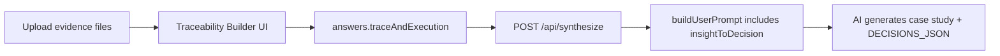
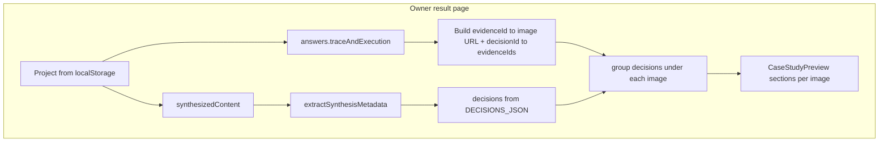

# [260326] Insight-to-Decision Traceability (Evidence-to-Execution)

## Goal

Add an explicit structure that links **evidence** (uploaded notes/photos) to **execution outcomes** via:

- **insights** (what you learned)
- **decisions** (what you chose to do)
- **insightToDecision links** (which decisions were driven by which insights)

You requested:

- Structured IDs (`insights[]`, `decisions[]`, mapping links)
- Merge “Process” + “Solution” into a single combined step that shows how these elements connect

## Current implementation (what we need to change)

- Questionnaire answers are currently bucketed as `process` and `solution` with plain text fields plus `files` arrays.
- Evidence (uploads) is stored but not linked to any insight/decision.
- AI prompt builder (`buildUserPrompt()` in `[lib/ai/prompts.ts]`) currently dumps text fields and uploaded text-file contents, without any mapping.

## Proposed data structure (QuestionnaireAnswers v2)

Add a new combined section, e.g. `traceAndExecution`, containing:

- `evidenceFiles`: array of `UploadFile` (reuse current UploadFile type)
- `insights`: array of `{ id, text, evidenceFileIds: string[] }`
- `decisions`: array of `{ id, text, execution: string, decisionRationale?: string, linkedInsightIds: string[] }`
- `insightToDecision`: array of `{ insightId, decisionId }` (explicit many-to-many)

Notes:

- We keep `evidenceFileIds` on insights (evidence→insight).
- We keep both `linkedInsightIds` on decisions and an explicit `insightToDecision` mapping; you can use either in UI/AI, but the mapping array is the explicit “Insight-to-Decision” requirement.

## Compatibility requirement

Because the synthesis API validates the payload with Zod (`[app/api/synthesize/route.ts]` uses `questionnaireAnswersSchema.safeParse(body.answers)`), we must keep old projects from breaking.

Plan:

- Keep the existing schema as a `v1` variant.
- Extend/export a `questionnaireAnswersSchema` that accepts either `v1` or `v2`.
- Update prompt builder to support both formats.

## Implementation steps

### 1. Update Zod schema

**File:** `[lib/questionnaire/schema.ts]`

- Add new exported types:
  - `InsightItem`
  - `DecisionItem`
  - `InsightToDecisionLink`
  - optionally `TraceAndExecutionAnswers`
- Add `traceAndExecution` into the new questionnaire shape.
- Keep the old `process` + `solution` keys as part of `v1` schema.
- Export `questionnaireAnswersSchema` as a union:
  - `z.union([questionnaireAnswersSchemaV1, questionnaireAnswersSchemaV2])`
- Update `defaultAnswers` to include the new `traceAndExecution` structure.

### 2. Update questionnaire step UI (merge Process+Solution)

**Files:**

- `[components/QuestionStep.tsx]`
- `[components/FileUpload.tsx]` (small extension)
- Add a dedicated client component, e.g. `TraceabilityBuilder.tsx`, used when the current section is the merged one.
- Replace the generic rendering for the merged section with custom UI that supports:
  - Upload evidence files (reusing `FileUpload`)
  - Add/edit multiple insights (each insight selects evidence file(s) by checkbox using upload `id`s)
  - Add/edit multiple decisions (each decision includes execution text)
  - Create Insight→Decision mapping:
    - UI for selecting mapping links (checkbox matrix or multi-select)
- Update `FileUpload` only if needed so the uploaded items are stored in `traceAndExecution.evidenceFiles` instead of the old per-section `files` buckets.

### 3. Update prompt building to include mapping

**File:** `[lib/ai/prompts.ts]`

- Update `buildUserPrompt()` to:
  - Detect whether answers include `traceAndExecution` (v2) or `process/solution` (v1)
  - For v2:
    - Include insights + their evidence sources
    - Include decisions + their execution text
    - Include explicit `insightToDecision` mapping
  - For v1:
    - Preserve existing behavior.
- Update `SYSTEM_PROMPT` with additional instruction when v2 is present:
  - “When traceability data is provided, explicitly connect each key decision to the insight(s) that drove it, and reference which evidence uploads support that insight.”

### 4. Update synthesis validation + payload expectations (no API changes expected)

**File:** `[app/api/synthesize/route.ts]`

- Likely no structural change beyond ensuring it can parse both schema versions.
- Confirm Zod union works with `request.json()` payload.

## Data flow (after change)

## Data flow (results page — owner, evidence under decisions)

Continuation after synthesis: use **client-side grouping** so images and decisions align with the questionnaire graph (no need to embed images in streamed markdown).

## Key files touched (for review)

- `[lib/questionnaire/schema.ts]`
- `[components/QuestionStep.tsx]`
- `[components/FileUpload.tsx]` (only if needed)
- `components/TraceabilityBuilder.tsx` (new)
- `[lib/ai/prompts.ts]`
- `[app/api/synthesize/route.ts]` (verify union compatibility)
- `[lib/questionnaire/traceability.ts]` (new — helper: decision → evidence file IDs; see continuation section)
- `[components/CaseStudyPreview.tsx]`
- `[app/project/[id]/result/page.tsx]`

## [260408] Alignment update (framework + decisions-first output)

To reflect the newer AI synthesis direction, this plan should align with the following output contract and UX behavior:

- The markdown case study should be concise for portfolio reuse:
  - target length: ~180-320 words
  - hard max: 380 words
- The main markdown narrative should not contain a standalone `## Insights` section (avoid duplicate content with structured metadata).
- Structured traceability output should be decision-first (not insight-first):
  - Replace `INSIGHTS_JSON` with `DECISIONS_JSON` in prompt/renderer contracts.
  - Decision entry shape:
    - `decisionText` (card heading)
    - `decisionDetails` (visible content)
    - `rationaleInsight` (hover rationale)
    - `sources[]` (traceable field/snippet pairs)
- UI behavior on result preview should render decision cards:
  - decision title/details visible by default
  - rationale shown on hover
  - sources shown with rationale in hover panel

### Contract markers (updated)

- `<!--DECISIONS_JSON_START--> ... <!--DECISIONS_JSON_END-->`
- `<!--FRAMEWORK_JSON_START--> ... <!--FRAMEWORK_JSON_END-->` remains for framework fit metadata

### File-level implications

- `[lib/ai/prompts.ts]`: enforce concise narrative + decisions JSON schema + no markdown insights section.
- `[components/CaseStudyPreview.tsx]`: parse `DECISIONS_JSON`; strip markdown insights section; render decisions-first cards with hover rationale.
- `[app/project/[id]/result/page.tsx]`: keep framework emphasis and metadata display as primary context for the narrative.

## [260409] Continuation — Evidence images grouped with decisions on results page

Merged from the standalone “evidence images under decisions” plan: this is the **next slice** after traceability + `DECISIONS_JSON` exist.

### Current state (results UI)

- **Images** for traceability live in `[lib/questionnaire/schema.ts]` as `traceAndExecution.evidenceFiles` (`UploadFile`: `id`, `name`, `type`, `base64`, …). Image MIME types are handled in `[lib/ai/client.ts]` for the model; the **UI does not yet render** those files under grouped decisions unless the continuation below is implemented.
- **Linkage graph (v2)**:
  - `insights[].evidenceFileIds` → evidence files
  - `decisions[].linkedInsightIds` → insights
  - `insightToDecision[]` reinforces insight ↔ decision pairs
- `**[app/project/[id]/result/page.tsx]`** only passes `content` (and streaming flag) to `[components/CaseStudyPreview.tsx]` unless extended. Parsed `DECISIONS_JSON` may render as a **flat list** without image context until grouping is wired.
- **Synthesized decisions** need a stable join to questionnaire rows: add `**questionnaireDecisionId`** in `DECISIONS_JSON` (see below); fallback to index match for old cached content.

### 1) Build evidence → decision mapping (deterministic)

For each questionnaire decision `d`:

1. Start from `d.linkedInsightIds`.
2. Optionally union insights implied by `insightToDecision` where `decisionId === d.id` (handles cases where only the mapping table is complete).
3. For each linked insight, collect `insight.evidenceFileIds`.
4. **Union** those file IDs → set of evidence images “supporting” that decision.

Helper: new module `[lib/questionnaire/traceability.ts]` with `getEvidenceIdsForDecision(trace, decisionId)` and `buildDecisionToEvidenceMap(trace)`.

**Edge cases:**

- Decision with **no** linked insights / no evidence → **“Unlinked decisions”** block (still show cards).
- One decision tied to **multiple** images → recommend **duplicate the card under each relevant image** for portfolio clarity (optional dedupe by `decisionId`).

### 2) Stabilize matching: `questionnaireDecisionId` in `DECISIONS_JSON`

Update `[lib/ai/prompts.ts]` so each synthesized decision includes:

- `questionnaireDecisionId`: must equal `traceAndExecution.decisions[i].id` when traceability is present (**id is authoritative** for UI merge).

Extend `[components/CaseStudyPreview.tsx]` parser to accept optional `questionnaireDecisionId`.

**Fallback:** match by **array index** when ids missing and lengths align.

### 3) Pass trace context into `CaseStudyPreview`

- Extend props: `traceAndExecution` (or v2 `answers` with type guard).
- On result page: when local/project has v2 answers, pass `traceAndExecution` into `CaseStudyPreview`.

**Suggested render order:**

1. Framework hero (if present)
2. Markdown narrative
3. For each **image** in `evidenceFiles` (filter `image/jpeg|png|webp`): render image + caption
4. Under each image: decision cards whose mapping includes that `evidenceFile.id`
5. Bottom: unlinked decisions + optional “evidence with no decisions”

Reuse existing decision card markup and hover behavior; only the **layout** becomes grouped sections.

### 4) Non-owner / published project caveat

`[app/api/project/[id]/route.ts]` returns JSON from blob. If payloads **omit** `base64` for size, viewers will not have images unless you store public URLs or extend publish. **Gate** image sections on usable `base64` or URL; document owner-only behavior until publish supports assets.

### 5) Prompt tweak (optional)

In `[lib/ai/prompts.ts]`, remind the model that `sources` may reference `traceAndExecution.evidenceFiles` by **filename** when tied to that evidence. **UI grouping does not depend on the model**—only `questionnaireDecisionId` + deterministic graph.

### Files to touch (continuation summary)

| File                                  | Change                                                               |
| ------------------------------------- | -------------------------------------------------------------------- |
| `[lib/questionnaire/traceability.ts]` | New: map decision → evidence file IDs                                |
| `[lib/ai/prompts.ts]`                 | Add `questionnaireDecisionId` to `DECISIONS_JSON` schema             |
| `[components/CaseStudyPreview.tsx]`   | Optional `traceAndExecution` prop; parse id; grouped layout + images |
| `[app/project/[id]/result/page.tsx]`  | Pass v2 trace data into preview                                      |

## Definition of done

- The questionnaire supports evidence→insight, insight→decision mapping.
- The AI prompt outputs decision-first traceability JSON (`DECISIONS_JSON`) so outputs can be traced.
- Result UI surfaces decisions (title/details) and insight rationale on hover without duplicating insights in markdown.
- **Continuation:** Owner viewing results sees each trace evidence **image** with the correct **decision cards** underneath, derived from questionnaire links (not from model guesswork); unlinked decisions and old syntheses without `questionnaireDecisionId` degrade gracefully (flat list or index match).
- Non-owner limitation documented if blob payload lacks image bytes.
- Old projects still synthesize successfully (v1 schema remains valid).

