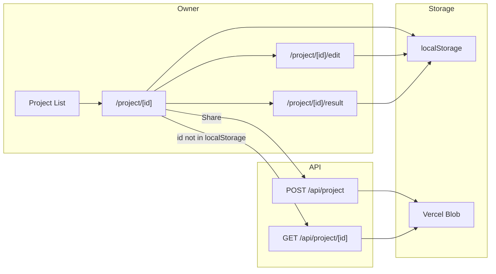

# [260310] URL-based shareable project links (Option 4)

## Current state

- Projects use long UUIDs and query params: `/questionnaire?projectId=...`, `/result?projectId=...`
- All data is in localStorage only; links are not shareable with others

## Target behavior

- Each project has a **short ID** (e.g. 8 chars) and a **canonical URL** `/project/[id]`
- **Owner flow**: Open `/project/abc123` → load from localStorage → see project hub (Edit / View result / Share)
- **Shared flow**: Someone opens `/project/xyz789` → not in localStorage → fetch from API → read-only (or view-only) project view
- **Share action**: Owner clicks "Share" → POST project to API → server stores copy under a new short ID → return shareable link

## Architecture

## Implementation

### 1. Short IDs and storage

**File: [lib/storage/projects.ts](lib/storage/projects.ts)**

- Add `generateShortId()`: 8-character alphanumeric string using `crypto.getRandomValues` (e.g. base36 from random bytes) so URLs stay short and readable.
- In `createProject()`, set `id: generateShortId()` instead of `crypto.randomUUID()`.
- Keep `getProject(id)` and the rest unchanged so existing UUID projects in localStorage still load (backward compatible).

### 2. Project API (server-side, for shareable links)

**New: `app/api/project/route.ts` (POST)**

- Body: `{ project: Project }` (full project object).
- Generate a **new** short ID for the shared copy (server-side, e.g. same `generateShortId` logic or use `crypto.randomUUID().slice(0, 8)`).
- Store in Vercel Blob: pathname `project/[id].json`, body `JSON.stringify(project)`, access `public` (or private if you prefer and then serve via API only).
- Return `{ id: string }` (the new shared id).

**New: `app/api/project/[id]/route.ts` (GET)**

- Fetch blob at pathname `project/[id].json` (same pattern as [app/api/showcase/[id]/route.ts](app/api/showcase/[id]/route.ts)).
- Return project JSON or 404.

Use existing `BLOB_READ_WRITE_TOKEN`; no new env vars.

### 3. New routes

**New: `app/project/[id]/page.tsx` (project hub)**

- Client component; read `id` from `useParams()`.
- Load project: first `getProject(id)` from localStorage. If found → **owner view**.
- If not in localStorage: `fetch(\`/api/project/${id})`. If 200 → **shared view** (read-only).
- If both miss → 404 / "Project not found".
- **Owner view**: Show project name, "Edit" → `/project/[id]/edit`, "View result" (if `synthesizedContent`) → `/project/[id]/result`, "Share" button, "Delete" (local only).
- **Shared view**: Show project name and "View case study" → same result view (read-only; no Edit/Share/Delete).
- **Share button (owner)**: On click, POST current project to `/api/project`, get `{ id: sharedId }`, build `window.location.origin + '/project/' + sharedId`, copy to clipboard and/or show in a small modal.

**New: `app/project/[id]/edit/page.tsx` (questionnaire)**

- Move questionnaire logic here (or reuse the same component). Read `id` from `useParams()`.
- Load project with `getProject(id)`; if missing, redirect to `/` (or create new and redirect to its edit).
- Persist to localStorage as today. On "Generate Case Study", redirect to `/project/[id]/result`.

**New: `app/project/[id]/result/page.tsx` (result)**

- Same as current result page but `id` from route params. Load project from localStorage **or** from `fetch(\`/api/project/${id})` when not in localStorage (shared view). If not found, 404. Show case study (read-only for shared).

### 4. Navigation and link updates

**File: [components/ProjectList.tsx](components/ProjectList.tsx)**

- "New Project": create project, then `router.push(\`/project/${project.id}/edit)`(or redirect to`/project/[id]/edit`).
- Each list item: link to `/project/[id]` (hub) instead of `/questionnaire?projectId=...`. Keep "View" as `/project/[id]/result` and stop using query `projectId` for primary flow.

**Optional backward compatibility**

- Keep `app/questionnaire/page.tsx` and `app/result/page.tsx`: if `projectId` query is present, redirect to `/project/[projectId]/edit` and `/project/[projectId]/result` so old bookmarks still work.

### 5. Result page links

**File: [app/result/page.tsx](app/result/page.tsx)** (if kept for redirect only)

- "Edit" link: `/project/[id]/edit`; "Create Showcase": `/showcase`. Same for the new `/project/[id]/result` page.

### 6. Showcase

- No change to showcase flow; it still reads from localStorage (owner’s projects). Shareable project links are independent (single project view).

## File summary

| Action                                              | File                                                                                                 |
| --------------------------------------------------- | ---------------------------------------------------------------------------------------------------- |
| Add short ID, use in createProject                  | [lib/storage/projects.ts](lib/storage/projects.ts)                                                   |
| POST store project, return id                       | `app/api/project/route.ts` (new)                                                                     |
| GET project by id                                   | `app/api/project/[id]/route.ts` (new)                                                                |
| Project hub (owner + shared)                        | `app/project/[id]/page.tsx` (new)                                                                    |
| Questionnaire under project                         | `app/project/[id]/edit/page.tsx` (new)                                                               |
| Result under project                                | `app/project/[id]/result/page.tsx` (new)                                                             |
| Links to /project/[id], create → /project/[id]/edit | [components/ProjectList.tsx](components/ProjectList.tsx)                                             |
| Optional redirect from query to path                | [app/questionnaire/page.tsx](app/questionnaire/page.tsx), [app/result/page.tsx](app/result/page.tsx) |

## Edge cases

- **ID collision**: Shared IDs are generated server-side; local IDs are client-side. Collision between a shared id and a local id is possible but unlikely (8 chars). Optional: use a prefix for shared (e.g. `s_abc123`) or longer server IDs.
- **Large payload**: Project JSON with base64 files can be large; Vercel Blob has limits. Existing 5 MB / 10 files per section already limit size; if needed, strip base64 from shared copy and store "uploaded files" as placeholders for shared view.
- **Existing UUID projects**: Keep supporting them in `getProject(id)` so old localStorage entries and old query links (if we add redirect) still work.

