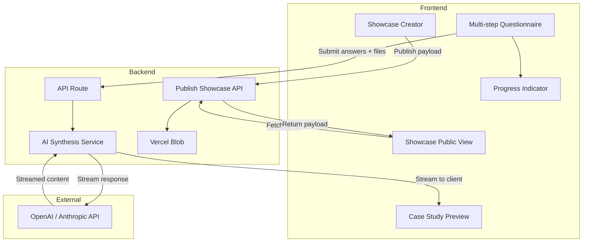

# UX Portfolio Questionnaire Webapp

## Concept

A step-by-step guided questionnaire that walks new UX professionals through reflecting on their projects. User inputs (text answers, process notes, and photos) are collected and sent to an AI model, which synthesizes them into polished, structured portfolio case study content (problem, process, solution, impact, etc.).

## Recommended Stack: Next.js + Tailwind CSS

- **Server-side AI calls**: API keys stay secure; never exposed to the client
- **API Routes**: Built-in backend for OpenAI/Anthropic/etc. integration
- **Streaming**: Support for streaming AI responses as they’re generated
- **React**: Good UX for multi-step forms, progress, and state
- **Tailwind CSS**: Utility-first styling for rapid UI development, responsive design, and consistent design tokens
- **Single codebase**: Simpler deployment (Vercel, etc.)

## High-Level Architecture




## Questionnaire Flow (Suggested Sections)


| Section              | Purpose         | Example Questions / Inputs                                                   |
| -------------------- | --------------- | ---------------------------------------------------------------------------- |
| Project Overview     | Context         | Project name, client/context, timeline                                       |
| Problem & Goals      | Framing         | What problem? Target users? Success criteria?                                |
| Process              | Design thinking | Research, ideation, iteration, key decisions; **upload process notes**       |
| Solution             | Deliverables    | Final design, rationale, tradeoffs; **upload photos** (screenshots, mockups) |
| Impact & Learnings   | Outcomes        | Metrics, feedback, personal learnings; **optional uploads**                  |
| Role & Collaboration | Ownership       | Your contribution, team size, stakeholders                                   |


## AI Integration Approach

1. **Synthesis endpoint** (`/api/synthesize`): Accepts all questionnaire answers, constructs a prompt with a case study template, and calls the AI API.
2. **Streaming**: Use server-sent events (SSE) or `ReadableStream` so synthesized content appears progressively.
3. **Prompt design**: System prompt defines the structure (Problem, Process, Solution, Impact, Learnings) and tone (professional, concise). User prompt includes all questionnaire answers.
4. **Optional**: Save drafts locally (e.g., localStorage) and support “edit & re-synthesize” for refinement.
5. **File inputs**: Process notes (text files) and photos are included in the synthesis. Notes are extracted as text; images are sent to a vision-capable model (e.g., GPT-4 Vision, Claude) for description and context.

## File Upload: Process Notes and Photos

- **Supported formats**: Photos (jpg, png, webp); process notes (txt, md). Optional: PDF for notes.
- **Client flow**: Drag-and-drop or file picker per question; preview thumbnails; optional captions per file.
- **Transmission**: Convert to base64 and include in JSON payload to `/api/synthesize`, or use `FormData` with multipart upload. Base64 keeps implementation simple for MVP (watch request size limits).
- **Server handling**: For images, pass to vision API as inline base64. For text files, read content and append to the user prompt. Associate each file with its question/section via metadata.
- **Size limits**: Enforce client- and server-side limits (e.g., 5 MB per image, 10 files max per section) to avoid timeouts and cost spikes.

## [260308] Multiple Projects (MVP: localStorage)

- **Storage**: Use `localStorage` to persist projects client-side. Each project: `{ id, name, createdAt, answers, synthesizedContent }`. No backend or auth required.
- **Landing page**: Show a project list (create new, open existing, delete). "Create new" starts a fresh questionnaire; "Open" loads that project's data into the flow.
- **Auto-save**: Persist answers and synthesized content to localStorage as the user progresses (or on step completion). Key by project `id` (e.g., `crypto.randomUUID()`).
- **Flow**: Landing → project list → select/create → questionnaire → result. From result, user can return to project list or edit/re-synthesize. From project list, user can also "Create showcase" to build a shareable portfolio page.
- **Limitations**: Data is per-browser; clearing storage loses projects. No sync across devices. Sufficient for MVP validation.

## Showcase: Create and Share a Portfolio Page

- **Purpose**: A single shareable page that displays selected projects for portfolio presentation (e.g., job applications, client pitches).
- **Creator flow**: From project list, user clicks "Create showcase" → selects which projects to include (one or many) → optionally reorders → adds optional showcase title → previews → publishes.
- **Share mechanism**: Publish stores the showcase payload (selected projects' names + synthesized content) via `POST /api/publish-showcase`. Returns a short ID. Public URL: `/showcase/[id]` — anyone with the link can view. Uses Vercel Blob (or similar) for ephemeral storage; no auth required.
- **Public view**: `/showcase/[id]` fetches the published payload and renders a clean, portfolio-style page with all selected case studies. Read-only; no edit controls.
- **Fallback**: "Export as HTML" — generate a self-contained HTML file the user can host elsewhere (e.g., GitHub Pages) if they prefer not to use the publish endpoint.

## Key Implementation Areas

- **Form state**: React state or a small library (e.g., Zustand) for multi-step form data, including file references and base64 blobs; sync to localStorage for project persistence
- **Validation**: Per-step validation before advancing; optional schema (e.g., Zod) for API payloads
- **UI**: Clear progress indicator, optional “back” navigation, accessible forms, styled with Tailwind
- **AI provider**: Start with OpenAI or Anthropic; use a vision-capable model (GPT-4o, Claude 3) when images are present; abstract behind a service so the provider can be swapped
- **Environment**: API key in `.env` (e.g., `OPENAI_API_KEY`); never sent to the client

## File Structure (Next.js App Router)

```
app/
  page.tsx              # Landing: project list (create, open, delete)
  questionnaire/
    page.tsx            # Main questionnaire flow
    layout.tsx          # Progress bar wrapper
  result/
    page.tsx            # Display synthesized case study
  showcase/
    page.tsx            # Creator: select projects, arrange, preview, publish
    [id]/
      page.tsx          # Public: view shared showcase by ID
api/
  synthesize/
    route.ts            # AI synthesis + streaming
  publish-showcase/
    route.ts            # POST: store showcase JSON, return shareable ID
lib/
  storage/
    projects.ts         # localStorage helpers: list, get, save, delete projects
  ai/
    client.ts           # AI API client (OpenAI/Anthropic)
    prompts.ts         # System + user prompt templates
  questionnaire/
    schema.ts           # Question definitions + validation
components/
  ProjectList.tsx       # Project list (create, open, delete)
  ShowcaseCreator.tsx   # Select projects, arrange, preview, publish
  ShowcaseView.tsx      # Public portfolio page layout
  QuestionStep.tsx      # Single step UI
  FileUpload.tsx        # Drag-drop / picker for notes and photos
  ProgressBar.tsx
  CaseStudyPreview.tsx  # Renders streamed content
```

## Styling with Tailwind CSS

- **Setup**: Use `create-next-app` with `--tailwind` flag, or add Tailwind to an existing Next.js project via `tailwindcss`, `postcss`, and `autoprefixer`
- **Config**: `tailwind.config.js` / `tailwind.config.ts` for custom colors, fonts, and breakpoints aligned with the app's visual identity
- **Usage**: Apply utility classes directly in components (e.g., `QuestionStep`, `ProgressBar`, `CaseStudyPreview`) for layout, typography, spacing, and responsive behavior
- **Benefits**: No separate CSS files for most styling; easy dark mode via `dark:` variants if desired; consistent spacing scale

## Environment & Config

- `.env.local`: `OPENAI_API_KEY` or `ANTHROPIC_API_KEY`; `BLOB_READ_WRITE_TOKEN` (Vercel Blob) for showcase publishing
- Optional: Add basic rate limiting or auth if you expect heavier usage

## Out of Scope (MVP)

- User accounts / server-side persistent storage
- Multi-language support
- Export to PDF or other formats
- Real-time collaboration

